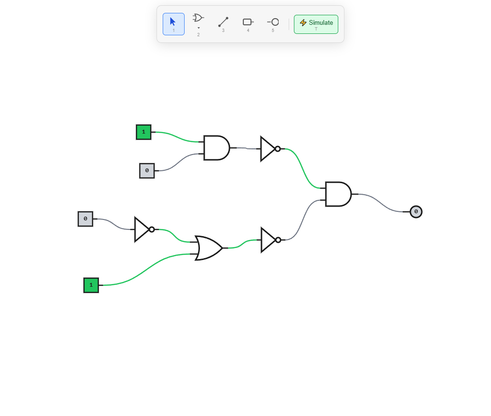

# Web-Based Circuit Logic Simulator



A browser-based digital logic circuit editor built with TypeScript and Vite. Place logic gates on a canvas, connect them with wires, and simulate signal propagation — all in the browser, no installation required.

> **Status:** Early development — UI and rendering are functional; simulation logic is in progress.

## Features

- Full-viewport HTML5 Canvas rendering
- Toolbar with selectable gate/tool modes
- Place logic gates by clicking the canvas
- Ghost preview follows the cursor while placing components
- Wire connections between component output and input pins
- Select, drag, and multi-select components (Ctrl+click and selection box)
- Real-time simulation with topological sort (Kahn's algorithm)
- Toggle switch inputs by clicking in select mode
- Light component as visual output indicator
- Supported components: AND gate, OR gate, NOT gate, Switch, Light

## Getting Started

### Prerequisites

- Node.js ≥ 18
- npm

### Install & run

```bash
npm install
npm run dev
```

Open [http://localhost:5173](http://localhost:5173) in your browser.

## Scripts

| Command | Description |
|---|---|
| `npm run dev` | Start Vite dev server |
| `npm run build` | Production build (outputs to `dist/`) |
| `npm run preview` | Preview production build locally |
| `npm run test` | Run all tests once |
| `npm run test:watch` | Run tests in watch mode |

## Project Structure

```
src/
  main.ts          # Orchestrator — DOM setup, canvas sizing, event handlers, render loop
  types.ts         # Core interfaces: Point, ComponentType, ComponentDef, PlacedComponent, EditorState, Wire
  state.ts         # State factory and mutations (addComponent, addWire, drag, selection, …)
  registry.ts      # Map<ComponentType, ComponentDef> — single source of truth for component definitions
  renderer.ts      # drawAll(), hit-testing (hitTest, hitTestPin), getPinPosition()
  simulation.ts    # evaluateCircuit() — topological sort + signal propagation
  handlers.ts      # Canvas event handlers — delegates to state mutations, calls reEvaluate()
  toolbar.ts       # HTML toolbar with tool-select buttons
  style.css        # Global styles, toolbar, canvas positioning
  components/
    and-gate.ts    # AND gate (arc body, 2 inputs, 1 output)
    or-gate.ts     # OR gate (curved body, 2 inputs, 1 output)
    not-gate.ts    # NOT gate (triangle + bubble, 1 input, 1 output)
    switch.ts      # Toggle switch (interactive input source)
    light.ts       # Light bulb (visual output indicator)
  __tests__/       # Vitest test files
```

## Architecture

- **Rendering:** continuous `requestAnimationFrame` loop — clears and redraws every frame.
- **Components:** pure objects with `draw(ctx, x, y, state?)` and `evaluate(inputs, state)` methods — stateless blueprints, easy to test and extend.
- **Component registry:** `Map<ComponentType, ComponentDef>` in `registry.ts`; add new gate types by registering them there.
- **Simulation:** topological sort (Kahn's algorithm) evaluates components in dependency order; cycles are detected and handled gracefully.
- **Event flow:** toolbar click → `setSelectedTool` → canvas interaction → state mutation → `reEvaluate()` → render loop picks up changes.

## Tech Stack

- [TypeScript](https://www.typescriptlang.org/) (strict mode, ES2020)
- [Vite](https://vitejs.dev/) (build tool & dev server)
- [Vitest](https://vitest.dev/) (unit testing)

## License

ISC
